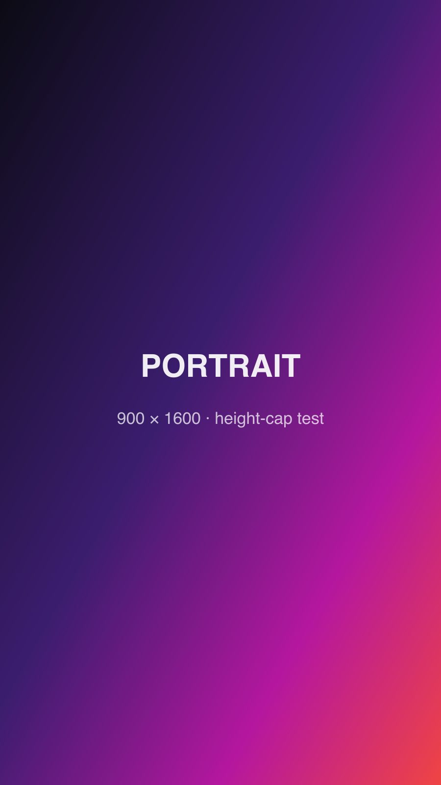

Welcome to the style sandbox and design system playground for Faint Signals. This post is used to visually test typography scaling, component spacing, and Markdown rendering under the Material Design 3 (M3) specifications.

## The Typography Hierarchy
Headings are the backbone of news storytelling. They should be bold, balanced, and punchy.

### Level 3 Heading: System Overview
Headings at this level provide sub-section context for complex reports.

#### Level 4 Heading: Technical Specifics
Even at lower levels, we maintain a strict black-weight aesthetic for consistency.

## Material Design 3 Typography Roles
Below are the core typography roles defined in our design system for various high-density reporting needs.

<p class="m3-display-large">Display Large: Brand Impact</p>
<p class="m3-headline-large">Headline Large: Breaking News Titles</p>
<p class="m3-focus-title">Focus Title: Highlighted Analysis Statements</p>
<p class="m3-lede">Lede Text: A thin, slanted, large-scale introduction for articles.</p>
<p class="m3-title-large">Title Large: Mid-level Section Headers</p>
<p class="m3-body-large">Body Large: Standard journalistic text at 17px for long-form reading.</p>
<p class="m3-label-large">Label Large: High-emphasis Metadata</p>
<p class="m3-label-medium">Label Medium: Standard Metadata and Captions</p>

## Standard Text Elements
Normal text is balanced at 18px for maximum legibility. We support standard formatting like **Bold Text** for emphasis, *Italic Text* for citations, and even ~~Strikethrough~~ for corrected reports.

### Superscripts and Subscripts
Technical reporting often requires scientific notation:
- H<sub>2</sub>O (Water detection on Europa)
- E = mc<sup>2</sup> (Mass-energy equivalence)

### Interactive Elements
<details>
<summary>View Technical Metadata</summary>
This section is hidden by default. It contains raw data, checksums, and architectural logs intended for developers and auditors only.
- Node ID: 8829-X
- Protocol: HTTPS/3
</details>

## Technical Documentation
Our portal is built for the modern age, featuring advanced code highlighting and data presentation.

### Inline and Block Code
For quick references, we use `console.log("Status: Live")` inline. For larger scripts, we use full blocks:

```javascript
// A simple status checker for the news feed
async function checkFeedStatus() {
  const response = await fetch('/api/v1/news-status');
  const data = await response.json();
  
  if (data.active) {
    console.log("Feed is operational.");
  }
}
```

### Data Tables
Tables are essential for economic reports and scientific data.

| Indicator | Value | Trend |
| :--- | :--- | :--- |
| Global AI Adoption | 68% | 📈 Up |
| Digital Asset Volume | $4.2T | 📈 Up |
| Neural Mesh Reliability | 99.9% | ↔ Steady |

## Citations and Quotes
> "The future of information delivery lies in the balance between high-density data and high-speed delivery. Our portal is the first step toward that synthesis."
> 
> — Lead Architect, Faint Signals Project

## Action Items and Multimedia
- [x] Implement Global CSS variables
- [x] Optimize asset delivery for mobile
- [ ] Finalize quantum-encryption protocols

### Visual Evidence

*Fig 1.1: High-resolution capture of the Europa chaos terrain showing potential subsurface lakes.*

## Imagery

Three shapes have to survive the same rules: capped at 75vh, outlined, and
centred, with no horizontal scroll at any width.

### Tall portrait

Taller than the viewport at its natural size, so this is the case that proves
the height cap. It should sit centred and fully visible without scrolling.


*Fig 2.1: 900 × 1600. Constrained by height, not width.*

### Wide landscape

The opposite case: width-constrained, so the cap should not engage at all.


*Fig 2.2: 1920 × 720. Constrained by width, not height.*

### Remote image through the wsrv proxy

Remote sources are rewritten to the wsrv.nl proxy with a WebP srcset, so this
exercises a different code path from the two local assets above.


*Fig 2.3: Remote source. Should be proxied, responsive, and capped like the rest.*

## Halftone

A dot screen masked out of a colour gradient. The boundary is the point: a
single ellipse reads as a shape someone drew, so several overlapping ones
union into a lumpy edge with no centre you can name. Any field has to finish
fading before its container clips it, or that edge is squared off again and
the whole effect is lost.

<div class="halftone-fade-blob" style="position:relative;height:200px;margin-bottom:1.5rem;overflow:hidden"><div class="halftone" style="--halftone-cell:13px;width:100%;height:100%"></div></div>

A second arrangement, so two fields on one page are not the same shape:

<div class="halftone-fade-blob-alt" style="position:relative;height:200px;margin-bottom:1.5rem;overflow:hidden"><div class="halftone" style="--halftone-cell:16px;filter:hue-rotate(120deg);width:100%;height:100%"></div></div>

Unmasked, which is only ever right for a filled block such as the cover art on
a post with no hero image:

<div style="position:relative;height:120px;margin-bottom:1.5rem;overflow:hidden"><div class="halftone" style="--halftone-cell:9px;filter:hue-rotate(-60deg);width:100%;height:100%"></div></div>

## Marker ink

One ink, two shapes. Both have to stay legible in either theme and survive a
line wrap without breaking the grid.

<p><span class="mark mark-signal">Accent swipe</span> &middot; <span class="mark-under mark-signal">accent underline</span></p>

### Across a line wrap

The next mark is long on purpose, because the failure mode worth catching is a
highlight that breaks into two disconnected boxes or spills past its column:
<span class="mark mark-signal">a marked phrase that has to run past the end of
one line and pick itself up cleanly on the next one without leaving a gap or a
hard edge where the wrap happened</span>. It should read as one continuous
sweep of the pen.

### On an uppercase display heading

<p class="m3-display-small"><span class="mark mark-signal">Uppercase</span> display type</p>

### Bare `<mark>` from markdown

A post can reach the kit with no extra classes: <mark>this phrase uses a plain
mark element</mark> and picks up the accent swipe automatically.

## Conclusion
This post confirms that our design system handles complex Markdown structures without sacrificing the premium, high-contrast news aesthetic we've built.
